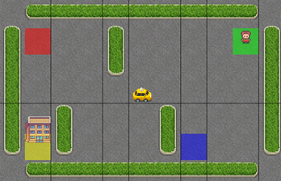

# 基于强化学习和马尔可夫模型的出租车代理

*目录* 

[TOC]

## 1. 问题描述

​	在一个$M\times N$ 的地图中，每个格子与相邻的四个格子连通，如果两个格子之间存在墙壁，则两者不再连通。Agent每步可以从一个格子移动到与之连通的另一个格子，或者进行载客/下客操作。

​	当乘客与出租车在同一个格子且乘客不在车内时进行上车操作会使乘客转移到车中。

​	当乘客在车内时进行下车操作会使乘客转移到车所在的地块。

​	地图中有四个出生点，游戏开始时乘客和目的地会随机刷新在不同的出生点。出租车会随机出生在地图中。

​	**得分规则**：

- 非法的上下车：-10 （与乘客不在同一个格子的情况下上车、车上无乘客或不在目的地时下车）
- 将乘客送达目的地：+20（乘客在车中、车在目的地时进行下车操作）
- 其他：-1 （移动、合法上下车）

当乘客抵达目的地后本局游戏结束，Agent 的目的是使得分最大化。

### 1.1 附加规则

​	为了增加难度与不确定性、以及添加前后局之间的关联性，我们添加了以下的附加规则。

#### 1.1.1 迷雾

​	在添加了迷雾的游戏中，存在一个额外的参数$V$ ，只有当乘客与出租车的曼哈顿距离小于V时，出租车才能收到乘客的位置信息，否则出租车无法知道乘客的位置。

#### 1.1.2 天气

​	

 

## 2. 模型介绍

### 2.1 Search Agent

​	采用广度优先算法（BFS）

### 2.2 Reinforcement Agent

### 2.3 Markov-Search Agent

## 3. 性能分析

### 2.1 Search Agent

Search agent 在基础规则下采用广度优先算法，易证其总是能找到最优解。

得分==在这里加数据==

### 2.2 Reinforcement Agent 在不同大小地图的表现

### 2.3 Markov-Search Agent 在附加规则下的表现

## 4. 主要贡献

**项目GitHub仓库**：https://github.com/PandragonXIII/AI-team-project 

## 参考文献

Gymnasium API: https://gymnasium.farama.org/environments/toy_text/taxi/ 

